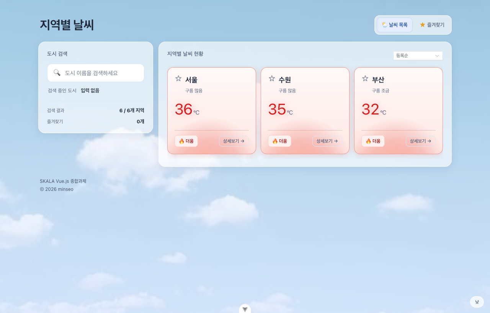
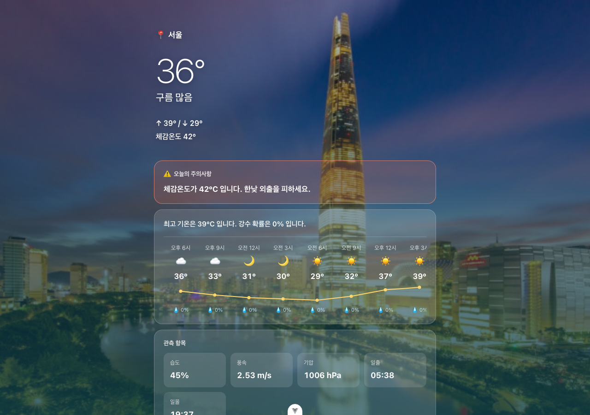

# 지역별 날씨 — skala-vue

SKALA Full-Stack Engineering · **Frontend framework: Vue.js** 종합과제입니다.
1일차 목업부터 4일차 배포까지, 화면 하나를 매일 이어서 키워 나가는 방식으로 만들었습니다.

국내 6개 지역의 **실시간 날씨**를 OpenWeatherMap API로 받아 보여 주고,
지역을 고르면 그 지역 랜드마크 사진이 화면을 가득 채우는 상세 화면으로 이동합니다.

- **저장소** — https://github.com/Leeminseo0718/skala-vue
- **배포 링크** — https://skala-vue-tawny.vercel.app

| 홈 (지역별 날씨) | 상세 (몰입 화면) |
| --- | --- |
|  |  |

---

## 실행 방법

```sh
git clone https://github.com/Leeminseo0718/skala-vue.git
cd skala-vue
npm install
cp .env.example .env      # 발급받은 OpenWeatherMap API 키를 채운다
npm run dev
```

기본 주소: http://localhost:5173

> API 키가 없어도 앱은 동작합니다. 저장된 목(mock) 데이터로 화면을 채우고 안내 문구를 띄웁니다.

| 명령어 | 설명 |
| --- | --- |
| `npm run dev` | 로컬 개발 서버 (HMR) |
| `npm run build` | `dist/` 에 배포용 정적 파일 생성 |
| `npm run preview` | 빌드 결과물 미리보기 |
| `npm run lint` | oxlint + ESLint 검사 및 자동 수정 |
| `npm run format` | Prettier 코드 정렬 |

---

## 구현한 기능

### 화면

| 경로 | 화면 | 설명 |
| --- | --- | --- |
| `/` | 날씨 목록 | 검색·정렬·즐겨찾기, 카드 가로 스크롤 |
| `/favorites` | 즐겨찾기 | 담아 둔 지역만 모아 보기, 평균 기온 |
| `/weather/:cityId` | 지역 상세 | 랜드마크 배경 몰입 화면, 24시간 예보 |
| `그 외` | 404 | Catch-all Route |

### 기능 목록

**검색 · 정렬**
- 도시 이름 부분 일치 검색 (`computed`)
- 등록순 / 이름순 / 기온 높은순 / 기온 낮은순 정렬 (`v-model` + `computed`)
- 검색어가 비면 원본, 일치하면 결과, 없으면 안내 문구

**즐겨찾기** *(직접 추가)*
- 카드의 별을 눌러 담기/빼기 — Pinia 스토어로 세 화면(목록·즐겨찾기·내비게이션 배지)이 같은 값을 봄
- `localStorage` 저장으로 새로고침해도 유지
- 담은 지역들의 평균 기온 계산

**실시간 날씨 (Axios)**
- 좌표(lat/lon) 기반 현재 날씨 + 5일/3시간 예보 조회
- 로딩 표시 · 실패 안내 · 8초 타임아웃
- `Promise.allSettled` — 일부 도시만 실패해도 나머지는 최신값 유지

**상세 화면** *(직접 추가)*
- 지역별 랜드마크 사진이 화면 전체 배경, 커서를 따라 살짝 움직임
- 24시간 기온 꺾은선 그래프(SVG) · 시간대별 아이콘 · 강수확률
- 관측값으로 판단하는 「오늘의 주의사항」

**배경 · 표현** *(직접 추가)*
- 시간대(아침/낮/해질녘/밤)에 따라 홈 배경 사진이 페이드로 전환
- 30도 이상 지역은 카드에 불길이 일렁이는 애니메이션
- 한글 IME 조합 처리 (`v-model` 없이 `:value` + `@input` 으로 구현했기 때문)

---

## 강의 내용 적용 위치

| 강의 항목 | 적용 위치 |
| --- | --- |
| 2. Vue 문법 | `v-for`·`:key`, `v-if/v-else`, `v-show`, `:class`, `@click.stop`, `@keyup.enter` |
| 3. Composition API | `ref` · `computed` · `watch` · `watchEffect` (`WeatherHomeView.vue`) |
| 4. Component | `props`/`emits`/`slot` 으로 4개 컴포넌트 분리 |
| 5. Vue Router | 지연 로딩, 동적 경로 `:cityId`, Catch-all, `router.push` |
| 6. Pinia | `stores/favoriteStore.js` (state·getters·actions) |
| 7. Axios | `api/weather.js` (로딩·에러 처리 포함) |
| 8. UI 라이브러리 | Element Plus — `el-select`, `el-alert`, `el-empty` |
| 9. Modern JS | 구조분해, 전개, 옵셔널 체이닝, 널 병합, 템플릿 리터럴 |
| 10. Vite 빌드·배포 | `base` 경로 설정, `.env` 분리, Vercel 자동 배포 (`vercel.json`) |

---

## 프로젝트 구조

```
src/
├── main.js                     플러그인 등록 (Pinia · Router · Element Plus)
├── App.vue                     하늘 배경 + 제목/내비게이션 + RouterView
├── router/index.js             라우트 규칙 (지연 로딩 · Catch-all)
├── api/weather.js              OpenWeatherMap 통신 (화면은 axios 를 직접 안 부른다)
├── stores/favoriteStore.js     즐겨찾기 전역 상태
├── data/
│   ├── weatherMock.js          도시 좌표 + API 실패 시 대체값
│   ├── weatherCondition.js     날씨 코드 → 한글 표기 · 아이콘
│   ├── landmarks.js            도시명 → 랜드마크 사진
│   └── skies.js                시간대 → 하늘 사진
├── components/exercise/
│   ├── BaseDashboardCard.vue   공통 패널 (기본 슬롯 + head-meta 슬롯)
│   ├── SearchBar.vue           검색 입력 (props + emits)
│   ├── WeatherCard.vue         날씨 카드 (props + emits)
│   └── SkyBackground.vue       시간대별 배경
└── views/
    ├── WeatherHomeView.vue     목록 (반응형 상태·computed·watch 보유)
    ├── FavoriteView.vue        즐겨찾기
    ├── WeatherDetailView.vue   상세 (몰입 화면)
    └── NotFoundView.vue        404
```

---

## 4일간 어려웠던 점과 해결 과정

### 1일차 — 한글이 입력창에서 깨지는 문제

과제 조건이 `v-model` 대신 `:value` + `@input` 으로 양방향 바인딩을 만드는 것이었는데,
이렇게 하면 **`v-model` 이 내부적으로 해 주던 한글 IME 조합 처리가 같이 빠집니다.**
`ㅅ → 서 → 설 → 서울` 처럼 조합 중인 글자가 튀거나 뒤집힐 수 있습니다.

`@compositionstart` / `@compositionend` 를 직접 붙여 조합 상태를 추적하고,
조합이 끝나는 시점에 완성된 값으로 한 번 더 확정하도록 했습니다.
조합 중에는 `조합 중` 뱃지를 띄워 동작을 눈으로 확인할 수 있게 했습니다.

### 2일차 — 정렬을 껐다 켜면 원래 순서로 못 돌아감

`Array.prototype.sort` 는 **원본 배열을 그 자리에서 뒤집습니다.**
검색 결과를 그대로 정렬했더니 원본 `weatherList` 순서까지 바뀌어
'등록순' 으로 되돌릴 방법이 없어졌습니다.

`[...filteredWeatherList.value]` 로 복사본을 만들어 정렬하도록 고쳤습니다.
정렬을 바꿨다가 '등록순' 으로 돌아왔을 때 원래 순서가 나오는 것으로 확인했습니다.

### 3일차 — 컴포넌트를 쪼개니 즐겨찾기가 서로 다른 값을 봄

즐겨찾기를 목록 화면 안에 `ref` 로 들고 있었는데, 즐겨찾기 화면이 따로 생기면서
두 화면이 같은 목록을 봐야 해졌습니다. 부모-자식 관계가 아니라 props 로는 못 넘기고,
화면마다 `localStorage` 를 각자 읽으면 한쪽에서 바꾼 게 다른 쪽에 안 비쳤습니다.

**Pinia 스토어**로 옮겨 컴포넌트 밖 한 곳에 두고 세 곳(목록·즐겨찾기·내비게이션 배지)이
같은 값을 보게 했습니다.

이때 토글을 `push`/`splice` 로 하면 `watch` 가 `deep` 없이는 안 걸리고,
`deep` 을 켜도 콜백의 이전/새 값이 같은 객체라 비교가 안 됩니다.
그래서 **새 배열로 갈아 끼우는 방식**으로 바꿨습니다.

### 4일차 — 화면이 통째로 안 그려지던 현상

패널에 `backdrop-filter` (유리 블러)를 넣었더니, 패널이 여러 개 쌓인 긴 페이지에서
**패널 내용이 통째로 안 그려지는 현상**이 있었습니다.
DOM 은 멀쩡한데(hit-test 도 잡힘) 페인트만 실패하는 형태였습니다.

배경이 매끈한 그라데이션이라 블러 효과가 사실상 보이지도 않아서 제거했습니다.

또 API 가 주는 한국어 번역이 `실 비`(light rain), `온흐림`(overcast clouds) 처럼
어색하고 일관성이 없었습니다. 번역문 대신 **날씨 코드(`weather[0].id`)를 직접
기상청식 표현으로 매핑**해서, API 경계 한 곳만 고쳐 세 화면이 모두 해결되게 했습니다.

---

## 제출 전 셀프 코드리뷰

**컴포넌트가 한 가지 역할만 하고 있나요?**
`WeatherCard` 는 "받은 걸 그리고 눌린 걸 알리는" 역할만 하고, 즐겨찾기 목록을 누가 들고
있는지도 모릅니다. 판단은 부모가 하고 결과(`isFavorite`)만 내려 줍니다.
`BaseDashboardCard` 는 껍데기만, `SearchBar` 는 입력만 맡습니다.

**굳이 반응형으로 안 만들어도 되지 않았나요?**
`SORT_OPTIONS`·`HOT_TEMP`·`SKY_SLOTS` 처럼 바뀌지 않는 값은 `ref` 로 감싸지 않고
일반 상수로 두었습니다. 커서 좌표도 매 이벤트마다 `ref` 에 쓰지 않고 일반 변수에 모았다가
`requestAnimationFrame` 에서 한 번만 반영해, 초당 수십 번의 재렌더를 막았습니다.

**API 요청 중·실패 상황을 사용자가 알 수 있게 처리했나요?**
요청 중에는 `el-alert` 로 "불러오는 중" 을 띄우고, 실패하면 화면을 비우는 대신
저장된 값을 그대로 두고 어떤 지역이 실패했는지 안내합니다.
8초 타임아웃을 걸어 네트워크가 죽어도 로딩 상태에 갇히지 않게 했습니다.

**변수·함수 이름만 보고 무엇을 하는지 알 수 있나요?**
`filteredWeatherList`(걸러진) → `sortedWeatherList`(정렬된) 처럼 이름에 처리 단계를 담았고,
불리언은 `isLoading`·`isBlazing`·`isEmptyResult` 처럼 `is` 로 시작하게 통일했습니다.
이벤트 핸들러는 `handle*`, 데이터를 가져오는 함수는 `fetch*` 로 맞췄습니다.

---

## 배포 (Vercel)

`main` 브랜치에 푸시하면 Vercel 이 자동으로 빌드해서 올립니다.

**설정할 것**

1. [vercel.com](https://vercel.com) → Add New Project → 이 저장소 Import
   (Framework Preset 은 **Vite** 로 자동 인식됩니다)
2. Environment Variables 에 `VITE_OPENWEATHER_API_KEY` 추가
3. Deploy

**빌드가 흰 화면으로 뜨지 않게 잡아 둔 것**

- **base 경로** — Vercel 은 도메인 루트로 서비스하므로 `vite.config.js` 의 `base` 를 `/` 로 둡니다.
  (GitHub Pages 처럼 하위 경로 `/저장소이름/` 에 올릴 때는 이 값을 바꿔야 합니다.
  안 맞추면 빌드된 JS·CSS 를 못 찾아 화면이 하얗게 뜹니다.)
- **SPA 새로고침** — `vercel.json` 의 `rewrites` 로 모든 경로를 `index.html` 로 넘깁니다.
  이게 없으면 `/weather/city_01` 을 직접 열거나 새로고침할 때 서버가 그 이름의 파일을
  찾다가 404 를 냅니다. 실제 경로 판단은 Vue Router 가 합니다.

> ⚠️ Vite 는 `VITE_` 로 시작하는 값을 빌드 시 번들에 그대로 박아 넣습니다.
> `.env` 를 Git 에 올리지 않아도 배포된 사이트에서는 키가 보입니다.
> 브라우저에서 직접 API 를 호출하는 구조상 피할 수 없고,
> 실제 서비스라면 백엔드를 한 겹 두고 키를 서버에 두어야 합니다.

---

## 개발 환경

- Vue 3.5 · Vite 8 · Vue Router 5 · Pinia 4 · Axios 1 · Element Plus 2
- VS Code + [Vue (Official)](https://marketplace.visualstudio.com/items?itemName=Vue.volar) 확장
- ESLint · oxlint · Prettier
